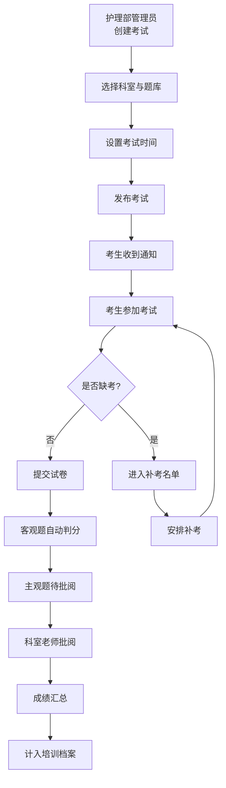

## 1. 产品概述

医院三基考试管理系统是面向医院护理部、科室、医护人员的在线考试与培训档案管理平台。系统实现按岗位分层考试、自动判分、主观题批阅、缺考补考、成绩归档与数据分析的全流程闭环管理。

- 解决传统纸质考试效率低、题库管理混乱、成绩统计困难的痛点
- 目标用户：院级管理员、护理部管理员、科室老师、医生/护士/技师

## 2. 核心功能

### 2.1 用户角色

| 角色 | 登录方式 | 核心权限 |
|------|----------|----------|
| 院级管理员 | 账号密码登录 | 查看全院考试汇总、薄弱知识点分析、培训档案总览 |
| 护理部管理员 | 账号密码登录 | 发布科室考试、题库管理、补考管理、全院成绩管理 |
| 科室老师 | 账号密码登录 | 批阅本科室主观题、查看本科室成绩 |
| 考生（医生/护士/技师） | 账号密码登录 | 参加考试、查看成绩与培训档案、参加补考 |

### 2.2 功能模块

1. **登录页**：角色选择登录、身份验证
2. **院级管理员仪表盘**：考试汇总统计、薄弱知识点分析、培训档案总览
3. **护理部管理端**：考试发布管理、题库管理、补考管理、成绩管理
4. **科室老师端**：待批阅列表、主观题批阅、本科室成绩查看
5. **考生端**：我的考试、在线考试、成绩查询、培训档案
6. **题库管理**：按岗位分类（医生/护士/技师）、题型管理（单选/多选/判断/主观题）

### 2.3 页面详情

| 页面名称 | 模块名称 | 功能描述 |
|----------|----------|----------|
| 登录页 | 登录表单 | 账号密码输入、角色选择、登录验证 |
| 院级仪表盘 | 数据概览 | 考试总数、参与率、平均分、合格率统计卡片 |
| 院级仪表盘 | 薄弱知识点 | 按知识点维度展示错误率排名 |
| 院级仪表盘 | 培训档案总览 | 各科室培训完成情况统计 |
| 考试管理 | 考试列表 | 查看/搜索考试、发布新考试、编辑/删除 |
| 考试管理 | 发布考试 | 选择科室、考试时间、题库、考试时长设置 |
| 题库管理 | 题库列表 | 按岗位分类展示题库、题目数量统计 |
| 题库管理 | 题目管理 | 新增/编辑/删除题目、支持单选/多选/判断/主观题 |
| 补考管理 | 缺考名单 | 自动识别缺考人员、生成补考名单 |
| 补考管理 | 补考安排 | 安排补考时间、发送补考通知 |
| 成绩管理 | 成绩列表 | 按考试/科室/人员查看成绩、导出成绩 |
| 主观题批阅 | 待批阅列表 | 显示待批阅主观题数量、快速进入批阅 |
| 主观题批阅 | 批阅页面 | 显示题目与考生答案、打分、写评语 |
| 考生首页 | 我的考试 | 待参加考试、已完成考试、补考通知 |
| 在线考试 | 考试页面 | 题目展示、答题、计时、提交试卷 |
| 成绩查询 | 成绩详情 | 得分、正确率、错题解析 |
| 培训档案 | 档案页面 | 历史考试记录、培训学分累计 |

## 3. 核心流程

### 3.1 考试发布与参与流程

护理部管理员创建考试 → 选择科室与岗位题库 → 设置考试时间 → 发布考试 → 考生收到考试通知 → 考生进入考试答题 → 客观题自动判分 → 主观题提交待批阅 → 科室老师批阅主观题 → 成绩汇总计入培训档案 → 缺考人员自动进入补考名单

### 3.2 院级管理员查看流程

院级管理员登录 → 查看全院考试汇总数据 → 查看薄弱知识点分析 → 查看各科室培训档案完成情况

## 4. 用户界面设计

### 4.1 设计风格

- **主色调**：医疗蓝（#165DFF），传达专业、可信的医疗行业属性
- **辅助色**：绿色（#00B42A）表示通过/正常，橙色（#FF7D00）表示警告/补考，红色（#F53F3F）表示未通过
- **中性色**：以锌灰色系为主，保持专业沉稳
- **按钮风格**：圆角 6px，扁平化设计，hover 时有轻微阴影提升
- **字体**：中文使用"PingFang SC"，数字使用"Inter"，清晰易读
- **布局风格**：侧边栏导航 + 顶部状态栏 + 内容区卡片式布局
- **图标风格**：使用 Lucide 线性图标，统一 24px 尺寸

### 4.2 页面设计概述

| 页面名称 | 模块名称 | UI 元素 |
|----------|----------|----------|
| 登录页 | 登录表单 | 左侧品牌展示区（医疗蓝渐变背景 + 医院图标），右侧白色登录卡片，输入框带图标，角色切换标签 |
| 院级仪表盘 | 数据概览 | 四色统计卡片（考试数/参与率/平均分/合格率），卡片带图标与趋势箭头 |
| 院级仪表盘 | 薄弱知识点 | 横向柱状图，按错误率降序排列，鼠标悬停显示详情 |
| 考试管理 | 考试列表 | 表格布局，带搜索筛选栏，操作按钮组，状态标签（未开始/进行中/已结束/已批阅） |
| 题库管理 | 题库列表 | 岗位分类标签页（医生/护士/技师），题目卡片网格，显示题型分布 |
| 在线考试 | 考试页面 | 顶部倒计时进度条，左侧题目导航，右侧答题区，底部上一题/下一题/交卷按钮 |
| 主观题批阅 | 批阅页面 | 左右分栏布局，左侧题目与参考答案，右侧考生答案与评分区 |

### 4.3 响应式

- 采用桌面端优先设计，主内容区最小宽度 1200px
- 侧边栏在平板宽度可折叠为图标模式
- 表格在小屏幕下支持横向滚动

### 4.4 动效设计

- 页面切换时内容区淡入（fade-in 200ms）
- 统计数字加载时滚动计数动画
- 按钮 hover 状态有颜色过渡（transition 150ms）
- 考试倒计时最后 5 分钟数字变红并轻微闪烁
