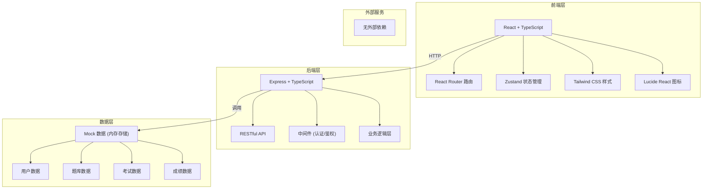
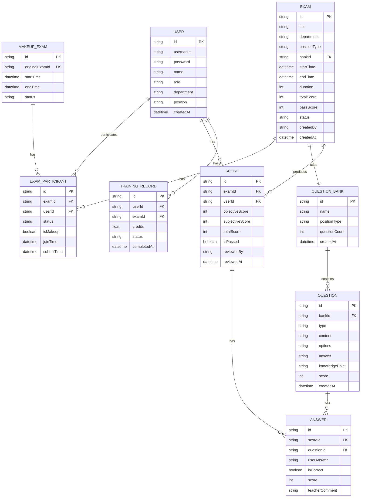

## 1. 架构设计



## 2. 技术选型说明

- **前端框架**: React@18 + TypeScript + Vite
- **路由**: react-router-dom@6
- **状态管理**: zustand
- **样式**: tailwindcss@3
- **图标**: lucide-react
- **后端框架**: Express@4 + TypeScript
- **数据库**: 内存 Mock 数据（前端演示用），后续可替换为 SQLite/PostgreSQL
- **初始化工具**: vite-init (react-express-ts 模板)

## 3. 路由定义

| 路由路径 | 页面名称 | 说明 |
|----------|----------|------|
| /login | 登录页 | 角色选择登录 |
| /admin/dashboard | 院级管理员仪表盘 | 全院数据汇总与薄弱知识点 |
| /nursing/exams | 护理部-考试管理 | 考试列表与发布 |
| /nursing/questions | 护理部-题库管理 | 按岗位分类的题库管理 |
| /nursing/makeup | 护理部-补考管理 | 缺考名单与补考安排 |
| /nursing/scores | 护理部-成绩管理 | 全院成绩查看与导出 |
| /teacher/review | 科室老师-待批阅列表 | 待批阅主观题列表 |
| /teacher/review/:id | 科室老师-批阅页面 | 主观题批阅打分 |
| /teacher/scores | 科室老师-成绩查看 | 本科室成绩查看 |
| /student/exams | 考生-我的考试 | 待考/已考/补考 |
| /student/exam/:id | 考生-在线考试 | 答题页面 |
| /student/scores | 考生-成绩查询 | 成绩列表与详情 |
| /student/profile | 考生-培训档案 | 历史记录与学分 |

## 4. 数据模型

### 4.1 ER 图



### 4.2 核心数据类型定义

```typescript
// 用户角色
type UserRole = 'admin' | 'nursing' | 'teacher' | 'student';
type PositionType = 'doctor' | 'nurse' | 'technician';

// 用户
interface User {
  id: string;
  username: string;
  name: string;
  role: UserRole;
  department: string;
  position: PositionType;
}

// 题库
interface QuestionBank {
  id: string;
  name: string;
  positionType: PositionType;
  questionCount: number;
  questions: Question[];
}

// 题目类型
type QuestionType = 'single' | 'multiple' | 'judge' | 'subjective';

// 题目
interface Question {
  id: string;
  bankId: string;
  type: QuestionType;
  content: string;
  options?: string[];
  answer: string;
  knowledgePoint: string;
  score: number;
}

// 考试
interface Exam {
  id: string;
  title: string;
  department: string;
  positionType: PositionType;
  bankId: string;
  startTime: string;
  endTime: string;
  duration: number;
  totalScore: number;
  passScore: number;
  status: 'pending' | 'ongoing' | 'ended' | 'reviewed';
  questionIds: string[];
  createdBy: string;
  createdAt: string;
}

// 考试参与记录
interface ExamParticipant {
  id: string;
  examId: string;
  userId: string;
  status: 'pending' | 'ongoing' | 'submitted' | 'absent';
  isMakeup: boolean;
  joinTime?: string;
  submitTime?: string;
}

// 成绩
interface Score {
  id: string;
  examId: string;
  userId: string;
  objectiveScore: number;
  subjectiveScore: number;
  totalScore: number;
  isPassed: boolean;
  answers: Answer[];
  reviewedBy?: string;
  reviewedAt?: string;
}

// 答题记录
interface Answer {
  id: string;
  questionId: string;
  userAnswer: string;
  isCorrect: boolean;
  score: number;
  teacherComment?: string;
}

// 薄弱知识点
interface WeakPoint {
  knowledgePoint: string;
  totalCount: number;
  wrongCount: number;
  wrongRate: number;
}
```

## 5. 目录结构

```
.
├── src/
│   ├── components/       # 公共组件
│   │   ├── Layout/        # 布局组件
│   │   ├── Card/          # 卡片组件
│   │   ├── Table/         # 表格组件
│   │   └── Form/          # 表单组件
│   ├── pages/             # 页面组件
│   │   ├── Login/           # 登录页
│   │   ├── admin/          # 院级管理员页面
│   │   ├── nursing/      # 护理部页面
│   │   ├── teacher/       # 科室老师页面
│   │   └── student/       # 考生页面
│   ├── hooks/             # 自定义 Hooks
│   ├── store/             # Zustand 状态管理
│   ├── utils/             # 工具函数
│   ├── types/             # TypeScript 类型定义
│   ├── mock/              # Mock 数据
│   └── App.tsx            # 应用入口
├── api/                    # 后端代码
│   ├── routes/             # 路由
│   ├── controllers/       # 控制器
│   ├── middleware/        # 中间件
│   └── data/              # 内存数据
└── shared/                # 前后端共享类型
```

## 6. API 接口设计

### 6.1 认证接口

| 方法 | 路径 | 说明 |
|------|------|------|
| POST | /api/auth/login | 用户登录 |
| POST | /api/auth/logout | 用户登出 |

### 6.2 题库接口

| 方法 | 路径 | 说明 |
|------|------|------|
| GET | /api/banks | 获取题库列表 |
| GET | /api/banks/:id | 获取题库详情 |
| POST | /api/banks | 创建题库 |
| PUT | /api/banks/:id | 更新题库 |
| DELETE | /api/banks/:id | 删除题库 |
| GET | /api/banks/:id/questions | 获取题目列表 |
| POST | /api/questions | 创建题目 |
| PUT | /api/questions/:id | 更新题目 |
| DELETE | /api/questions/:id | 删除题目 |

### 6.3 考试接口

| 方法 | 路径 | 说明 |
|------|------|------|
| GET | /api/exams | 获取考试列表 |
| GET | /api/exams/:id | 获取考试详情 |
| POST | /api/exams | 创建考试 |
| PUT | /api/exams/:id | 更新考试 |
| DELETE | /api/exams/:id | 删除考试 |
| POST | /api/exams/:id/participants | 获取考试参与人员 |

### 6.4 成绩接口

| 方法 | 路径 | 说明 |
|------|------|------|
| GET | /api/scores | 获取成绩列表 |
| GET | /api/scores/:id | 获取成绩详情 |
| GET | /api/scores/exam/:examId | 按考试获取成绩 |
| POST | /api/scores/submit | 提交试卷 |
| PUT | /api/scores/:id/review | 批阅主观题 |

### 6.5 补考接口

| 方法 | 路径 | 说明 |
|------|------|------|
| GET | /api/makeup/absent | 获取缺考名单 |
| POST | /api/makeup | 创建补考 |
| GET | /api/makeup | 获取补考列表 |

### 6.6 统计接口

| 方法 | 路径 | 说明 |
|------|------|------|
| GET | /api/stats/summary | 获取汇总统计 |
| GET | /api/stats/weak-points | 获取薄弱知识点 |
| GET | /api/stats/training | 培训档案统计 |
